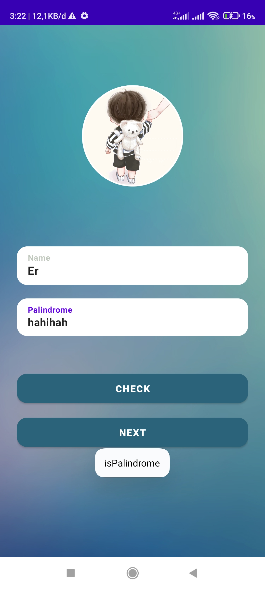
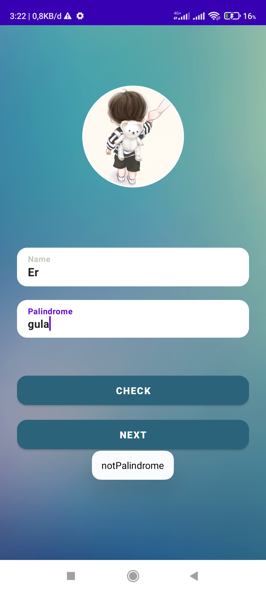
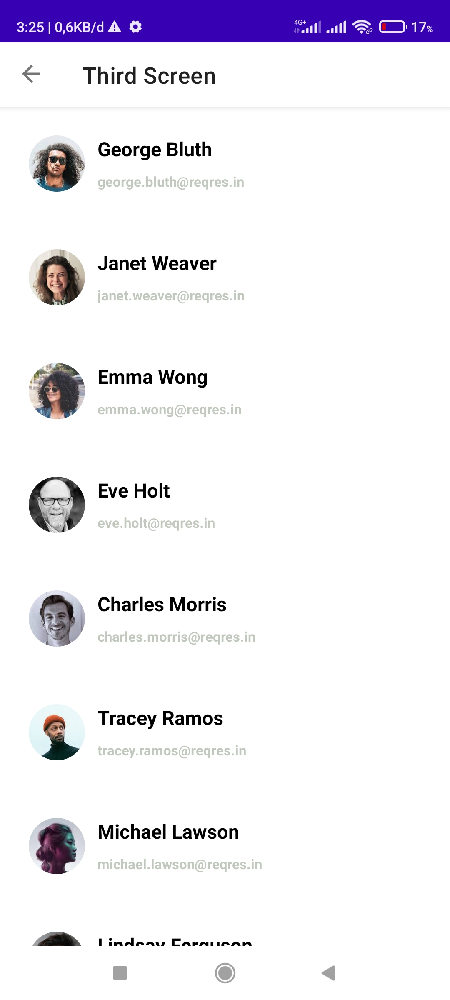
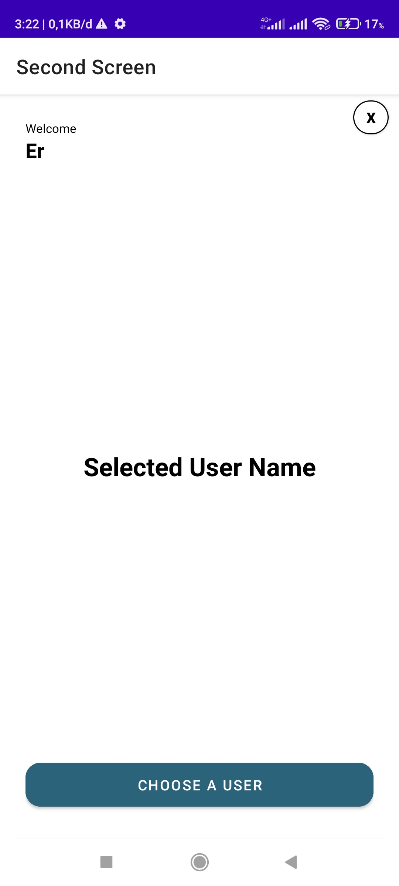

# Suitmedia Exam Mobile App

A simple android mobile apps built with Android Studio using Kotlin and JetpackCompose.

## Working Environtment

This app only works in Android OS with minimum 19 SDK and Target 31 SDK

## Screenshot

### Home Screen & Palindrom Test
##### Test : True


##### Test : False


### Second Screen

##### Before Selected :

##### After Selected :


### Third Screen



## Stack

### FE

- Retrofit
- Android Material
- Coroutines
- Glide

### Features

- Responsive Layout (any screen dp)
- Dark Mode (on going)
- Palindrom Checker
- Fetching Data from URL

### CI/CD -- Release

- apk builder (android studio -- manual)
- 

## Installation

```bash
# Clone this project
git clone https://github.com/Amike31/Suitmedia_mobile.git

-- Apk Installation
# Cd to 'Installer Apk' Folder
cd "Installer Apk"
# Install 'Suitmedia_Rahmat.apk' into a Phone
# Give Permission to Security Installer
# Happy Using the App..!

-- Build Purpose
# Cd to 'Code' Folder
cd Code
# Open Android Studio in Code Folder
# Wait for Gradle Build

## You can test this app via emulator or physical device 
#  in Android studio
#  Happy Coding..!!
```

## Directory sturcture code

### Group by folder

````
├── Code/          	#Coding Files
│
├── Screenshot/     #Screenshot images
|
└── Installer Apk/	#Apk Installer for Android```
````